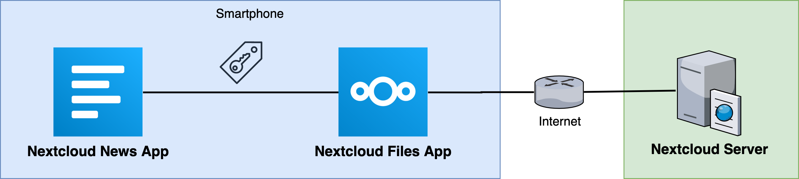
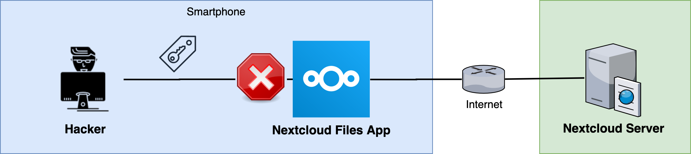
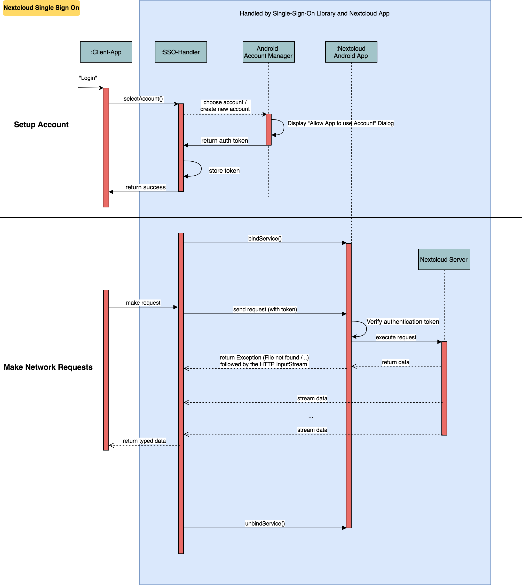

# Nextcloud Single Sign On

[](https://www.codacy.com/app/Nextcloud/Android-SingleSignOn?utm_source=github.com&utm_medium=referral&utm_content=nextcloud/Android-SingleSignOn&utm_campaign=Badge_Grade)
[](https://jitpack.io/#nextcloud/Android-SingleSignOn)
[](https://github.com/nextcloud/Android-SingleSignOn/issues)
[](https://github.com/nextcloud/Android-SingleSignOn/stargazers)
[](https://www.gnu.org/licenses/gpl-3.0)

This library allows you to use accounts as well as the network stack provided by the [nextcloud files app](https://play.google.com/store/apps/details?id=com.nextcloud.client). Therefore you as a developer don't need to worry about asking the user for credentials as well as you don't need to worry about self-signed ssl certificates, two factor authentication, save credential storage etc.

*Please note that the user needs to install the [nextcloud files app](https://play.google.com/store/apps/details?id=com.nextcloud.client) in order to use those features.* While this might seem like a "no-go" for some developers, we still think that using this library is worth consideration as it makes the account handling much faster and safer.

- [How to use this library](#how-to-use-this-library)
  - [1) Add this library to your project](#1-add-this-library-to-your-project)
  - [2) To choose an account, include the following code in your login dialog](#2-to-choose-an-account-include-the-following-code-in-your-login-dialog)
  - [3) To handle the result of the Account Chooser, include the following](#3-to-handle-the-result-of-the-account-chooser-include-the-following)
  - [4) How to get account information?](#4-how-to-get-account-information)
  - [5) How to make a network request?](#5-how-to-make-a-network-request)
    - [5.1) Using Retrofit](#51-using-retrofit)
    - [5.2) Without Retrofit](#52-without-retrofit)
    - [5.3) WebDAV](#53-webdav)
- [Additional info](#additional-info)
- [Security](#security)
- [Media](#media)
  - [Talks at the Nextcloud Conference](#talks-at-the-nextcloud-conference)
  - [Demo video](#demo-video)
- [Known apps](#known-apps)
- [Troubleshooting](#troubleshooting)
- [Flow diagram](#flow-diagram)
- [Translations](#translations)

## How to use this library

You can check out the [sample app](https://github.com/nextcloud/Android-SingleSignOn/tree/master/sample) which uses this library to fetch some information via SSO from a Nextcloud instance.
The sample app uses the [Retrofit approach](#51-using-retrofit). Be aware though, that it is for demonstration purposes only. Exception handling, state management etc. must be implemented depending on your use case.

### 1) Add this library to your project

```gradle
repositories {
    // …
    maven { url "https://jitpack.io" }
}

dependencies {
    // Note: Android Gradle Plugin (AGP) version ≥ 7.0.0 is required.
    implementation "com.github.nextcloud:Android-SingleSignOn:0.6.0"
}
```

### 2) To choose an account, include the following code in your login dialog

```java
private void openAccountChooser() {
    try {
        AccountImporter.pickNewAccount(activityOrFragment);
    } catch (NextcloudFilesAppNotInstalledException | AndroidGetAccountsPermissionNotGranted e) {
        UiExceptionManager.showDialogForException(this, e);
    }
}
```

### 3) To handle the result of the Account Chooser, include the following

```java
@Override
public void onActivityResult(int requestCode, int resultCode, Intent data) {
    super.onActivityResult(requestCode, resultCode, data);
    AccountImporter.onActivityResult(requestCode, resultCode, data, this, new AccountImporter.IAccountAccessGranted() {

        @Override
        public void accountAccessGranted(SingleSignOnAccount account) {
            final var context = getApplicationContext();

            // As this library supports multiple accounts we created some helper methods if you only want to use one.
            // The following line stores the selected account as the "default" account which can be queried by using
            // the SingleAccountHelper.getCurrentSingleSignOnAccount(context) method
            SingleAccountHelper.setCurrentAccount(context, account.name);

            // Get the "default" account
            SingleSignOnAccount ssoAccount = null;
            try {
                ssoAccount = SingleAccountHelper.getCurrentSingleSignOnAccount(context);
            } catch (NextcloudFilesAppAccountNotFoundException | NoCurrentAccountSelectedException e) {
                UiExceptionManager.showDialogForException(context, e);
            }

            final var nextcloudAPI = new NextcloudAPI(context, ssoAccount, new GsonBuilder().create());

            // TODO … (see code in section 4 and below)
        }
    });
}

@Override
public void onRequestPermissionsResult(int requestCode, @NonNull String[] permissions, @NonNull int[] grantResults) {
    super.onRequestPermissionsResult(requestCode, permissions, grantResults);
    AccountImporter.onRequestPermissionsResult(requestCode, permissions, grantResults, this);
}

// Complete example: https://github.com/nextcloud/news-android/blob/890828441ba0c8a9b90afe56f3e08ed63366ece5/News-Android-App/src/main/java/de/luhmer/owncloudnewsreader/LoginDialogActivity.java#L470-L475

```

### 4) How to get account information?

```java
// If you stored the "default" account using setCurrentAccount(…) you can get the account by using the following line:
final var ssoAccount = SingleAccountHelper.getCurrentSingleSignOnAccount(context);

// Otherwise (for multi-account support you'll have to keep track of the account names yourself. Note: this has to be the name of SingleSignOnAccount.name)
AccountImporter.getSingleSignOnAccount(context, accountName);

ssoAccount.name; // Name of the account used in the android account manager
ssoAccount.username;
ssoAccount.token;
ssoAccount.url;
```

### 5) How to make a network request?

```java
public NextcloudAPI(Context context, SingleSignOnAccount account, Gson gson) {
```

You'll notice that there is an optional `ApiConnectedListener` callback parameter in the constructor of the `NextcloudAPI`.
You can use this callback to subscribe to errors that might occur during the initialization of the API.
You can start making requests to the API as soon as you instantiated the `NextcloudAPI` object.
The callback method `onConnected` will be called once the connection to the files app is established.
You can start making calls to the api before that callback is fired as the library will queue your calls until the connection is established[¹](https://github.com/nextcloud/Android-SingleSignOn/issues/400).

#### 5.1) **Using Retrofit**

##### 5.1.1) Before using this single sign on library, your interface for your retrofit API might look like this:

```java
public interface API {

    String mApiEndpoint = "/index.php/apps/news/api/v1-2/";

    @GET("user")
    Observable<UserInfo> user();

    // use ParsedResponse, in case you also need the response headers. Works currently only for Observable calls.
    @GET("user")
    Observable<ParsedResponse<UserInfo>> user();

    @POST("feeds")
    Call<List<Feed>> createFeed(@Body Map<String, Object> feedMap);

    @DELETE("feeds/{feedId}")
    Completable deleteFeed(@Path("feedId") long feedId);

    // …
}
```

You might instantiate your retrofit `API` by using something like this:

```java
public class ApiProvider {

    private final API mApi;

    public ApiProvider() {
        mApi = retrofit.create(API.class);
    }
}
```

##### 5.1.2) Use of new API using the nextcloud app network stack

```java
public class ApiProvider {

    private final API mApi;

    public ApiProvider(@NonNull NextcloudAPI.ApiConnectedListener callback) {
       final var ssoAccount = SingleAccountHelper.getCurrentSingleSignOnAccount(context);
       final var nextcloudAPI = new NextcloudAPI(context, ssoAccount, new GsonBuilder().create(), callback);
       mApi = new NextcloudRetrofitApiBuilder(nextcloudAPI, API.mApiEndpoint).create(API.class);
   }
}
```

Enjoy! If you're already using retrofit, you don't need to modify your application logic. Just exchange the API and you're good to go!

Note: If you need a different mapping between your json-structure and your java-structure you might want to create a custom type adapter using `new GsonBuilder().create().registerTypeAdapter(…)`. Take a look at [this](https://github.com/nextcloud/news-android/blob/783836390b4c27aba285bad1441b53154df16685/News-Android-App/src/main/java/de/luhmer/owncloudnewsreader/helper/GsonConfig.java) example for more information.

#### 5.2) **Without Retrofit**

`NextcloudAPI` provides a method called `performNetworkRequest(NextcloudRequest request)` that allows you to handle the server response yourself.

```java
public class MyActivity extends AppCompatActivity {

    private NextcloudAPI mNextcloudAPI;

    @Override
    protected void onStart() {
        super.onStart();
        try {
            final var ssoAccount = SingleAccountHelper.getCurrentSingleSignOnAccount(this);
            mNextcloudAPI = new NextcloudAPI(this, ssoAccount, new GsonBuilder().create());

            // Start download of file in background thread (otherwise you'll get a NetworkOnMainThreadException)
            new Thread(this::downloadFile).start();
        } catch (NextcloudFilesAppAccountNotFoundException | NoCurrentAccountSelectedException e) {
            // TODO handle errors
        }
    }

    @Override
    protected void onStop() {
        super.onStop();
        // Close Service Connection to Nextcloud Files App and
        // disconnect API from Context (prevent Memory Leak)
        mNextcloudAPI.stop();
    }

    private void downloadFile() {
        final List<Pair<String, String>> parameters = new ArrayList<>();
        parameters.add(new QueryPair("quality", "1024p"));
        parameters.add(new Pair<>("someOtherParameter", "parameterValue"));
        
        final var nextcloudRequest = new NextcloudRequest.Builder()
                .setMethod("GET")
                .setParameter(parameters)
                .setUrl(Uri.encode("/remote.php/webdav/sample movie.mp4","/"))
                .build();

        try (final var inputStream = mNextcloudAPI.performNetworkRequest(nextcloudRequest)) {
            while(inputStream.available() > 0) {
                inputStream.read();
                // TODO do something useful with the data here..
                // like writing it to a file…?
            }
        } catch (Exception e) {
            // TODO handle errors
        }
    }
}
```

#### 5.3) **WebDAV**

The following `WebDAV` Methods are supported: `PROPFIND` / `MKCOL`

The following examples shows how to use the `PROPFIND` method. With a depth of 0.

```java
final List<String> depth = new ArrayList<>();
depth.add("0");
header.put("Depth", depth);

final var nextcloudRequest = new NextcloudRequest.Builder()
        .setMethod("PROPFIND")
        .setHeader(header)
        .setUrl(Uri.encode("/remote.php/webdav/" + remotePath, "/"))
        .build();
```

## Additional info

In case that you require some sso features that were introduced in a specific nextcloud files app version, you can run a simple version check using the following helper method:

```java
final int MIN_NEXTCLOUD_FILES_APP_VERSION_CODE = 30030052;

if (VersionCheckHelper.verifyMinVersion(context, MIN_NEXTCLOUD_FILES_APP_VERSION_CODE, FilesAppType.PROD)) {
   // Version requirement is satisfied!
}
```

## Security

Once the user clicks on "Allow" in the login dialog, the Nextcloud Files App will generate a token for your app. Only your app is allowed to use that token. Even if another app will get a hold of that token, it won't be able to make any requests to the nextcloud server as the nextcloud files app matches that token against the namespace of your app.





## Media

### Talks at the Nextcloud Conference

| 2018 (5min) | 2020 (5min) |
| --- | --- |
| [](https://www.youtube.com/watch?v=gnLOwmrJLUw) | [](https://www.youtube.com/watch?v=oQJWAv2wVuc) |

### Demo video


## Known apps

- [Nextcloud News app](https://github.com/nextcloud/news-android)
  - [API](https://github.com/nextcloud/news-android/blob/master/News-Android-App/src/main/java/de/luhmer/owncloudnewsreader/reader/nextcloud/NewsAPI.java)
  - [API-Provider (Dagger)](https://github.com/nextcloud/news-android/blob/master/News-Android-App/src/main/java/de/luhmer/owncloudnewsreader/di/ApiProvider.java#L105-L114)
  - [Login Activity](https://github.com/nextcloud/news-android/blob/master/News-Android-App/src/main/java/de/luhmer/owncloudnewsreader/LoginDialogActivity.java)
- [Nextcloud Notes app](https://github.com/stefan-niedermann/nextcloud-notes)
  - [API](https://github.com/stefan-niedermann/nextcloud-notes/blob/master/app/src/main/java/it/niedermann/owncloud/notes/persistence/ApiProvider.java#L85-L106)
  - [Login](https://github.com/stefan-niedermann/nextcloud-notes/blob/master/app/src/main/java/it/niedermann/owncloud/notes/shared/util/SSOUtil.java#L33)
- [Nextcloud Deck app](https://github.com/stefan-niedermann/nextcloud-deck/)
  - [API](https://github.com/stefan-niedermann/nextcloud-deck/blob/master/app/src/main/java/it/niedermann/nextcloud/deck/api/DeckAPI.java)
  - [Login](https://github.com/stefan-niedermann/nextcloud-deck/blob/master/app/src/main/java/it/niedermann/nextcloud/deck/ui/ImportAccountActivity.java#L77)

## Troubleshooting

If you are experiencing any issues, the following tips might workaround:
- Disable battery optimizations of the nextcloud files app, especially [in case of a `NextcloudApiNotRespondingException`](https://github.com/nextcloud/Android-SingleSignOn/issues/162)
- [Permit auto start](https://github.com/stefan-niedermann/nextcloud-deck/issues/660#issuecomment-682002392)
- A quickly appearing and disappearing menu when attempting to select an account is often a hint for an outdated Nextcloud files app

## Flow Diagram

Note that the "Make network request" section in the diagram only shows the workflow if you use the "retrofit" api.



# Translations

We manage translations via [Transifex](https://www.transifex.com/nextcloud/nextcloud/android-singlesignon/). So just request joining the translation team for Android on the site and start translating. All translations will then be automatically pushed to this repository, there is no need for any pull request for translations.
